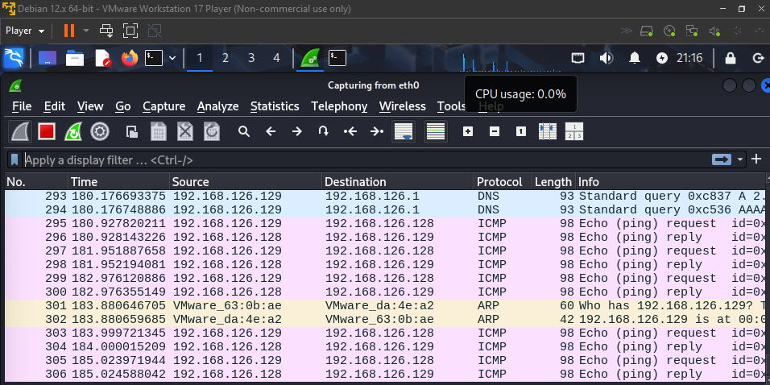

# Packet Analysis and Exploitation Walkthrough

## Executive Summary
This project provides a technical walkthrough of network traffic analysis and exploitation exercises conducted in a controlled virtual lab environment.  
Using industry-standard tools such as **Wireshark**, **Metasploit**, **Hydra**, and **Nmap**, I captured and analyzed live traffic, executed exploits against vulnerable services, and documented the resulting network behaviors.

The objective was to develop proficiency in recognizing normal and abnormal packet patterns — a critical skillset for roles in Security Operations Centers (SOC) and broader cybersecurity fields.

---

## Tools and Environment
- **Wireshark** — Network packet capture and analysis
- **Metasploit Framework** — Exploitation toolkit
- **Hydra** — Brute-force login tool
- **Nmap** — Network reconnaissance tool
- **Debian Linux** — Attacker machine
- **Metasploitable 2** — Vulnerable target machine
- **VMware Workstation 17 Player** — Virtualization platform

---

## Methodology and Captured Activities

### 1. Baseline Traffic Capture
Captured standard network communications including:
- ARP packets (local network address resolution)
- ICMP packets (ping requests/replies)
- DNS packets (domain resolution)
- TCP packets (standard connection handshakes)

Captured Evidence:
- 
- 

---

### 2. Nmap SYN Scan
Performed an Nmap TCP SYN scan targeting the Metasploitable system (`192.168.126.128`) to enumerate open ports.

Captured Evidence:
- 
- 

Key Observations:
- TCP SYN packets without corresponding ACKs indicated stealth scanning behavior.

---

### 3. TCP SYN Packet Filtering
Applied Wireshark filter:

```bash
tcp.flags.syn == 1 && tcp.flags.ack == 0
```

to isolate SYN packets and detect scan attempts.

Captured Evidence:
- 

---

### 4. FTP Exploitation via Metasploit
Exploited the vulnerable **vsftpd v2.3.4** FTP service to gain a root shell on the target.

Captured Evidence:
- 
- 

Key Observations:
- Unauthorized shell sessions appeared after exploitation.
- Reverse TCP connections established during the attack phase.

---

### 5. Brute Force Attack via Hydra
Conducted a brute-force attack against the FTP service using the Hydra tool with the `rockyou.txt` wordlist.

Captured Evidence:
- 
- 

Key Observations:
- Rapid repeated TCP session initiations visible during brute-force attacks.
- Repeated login failures signal credential stuffing attempts.

---

### 6. Suspicious TCP Reset Patterns
Captured large numbers of TCP Reset (RST) packets indicating abnormal session behavior during exploitation and brute-force phases.

Captured Evidence:
- 

---

### 7. ICMP Host Reachability Test
Tested basic connectivity to the target using ICMP pings prior to attacks.

Captured Evidence:
- 

Key Observations:
- Consistent ICMP echo replies confirmed host availability.

---

## Key Findings
- Developed proficiency in recognizing different packet types (ARP, ICMP, DNS, TCP).
- Understood the signature network behaviors associated with scanning, exploitation, and brute-force attacks.
- Strengthened skills in packet filtering, forensic analysis, and traffic pattern recognition.

---

## Importance of Packet Analysis for SOC Analysts
Packet-level analysis is essential for SOC analysts:
- **Threat Hunting**: Identifying scanning, probing, and brute-force behaviors in real time.
- **Alert Validation**: Confirming IDS/IPS triggers through raw packet examination.
- **Incident Response**: Reconstructing intrusion timelines and attack vectors through PCAP analysis.
- **Network Defense**: Recognizing early indicators of compromise before major breaches occur.

Understanding how legitimate and malicious network traffic behaves at the packet level provides actionable intelligence for cybersecurity defense.

---

## Future Work
- Extend analysis to include UDP-based protocols and attacks.
- Integrate real-time alerting with IDS/IPS solutions like Snort.
- Perform deeper forensic packet analysis post-incident.
- Study SSL/TLS encrypted traffic patterns and identify anomalies.
- Simulate Advanced Persistent Threat (APT) techniques for more complex network behaviors.

---

# Conclusion
This lab exercise strengthened my ability to see attacks through packet-level evidence and enhanced my capability to detect and analyze network threats — key competencies for any future cybersecurity professional working within a SOC environment.

---
